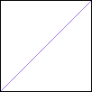

# Introduction to Graphics

An overview of graphics using the [C++ Utils](https://github.com/ILXL/cpputils) ``graphics`` classes.

## Setup

*You can follow this guide from your own machine, or try from [lab.cs50.io](https://lab.cs50.io/ILXL-guides/intro-to-graphics). If you are not using CS50, you will see some markdown for cs50 using curly braces and percentage signs, which you can ignore.*

1. Start by creating a new folder in which we can complete the guide.

  ```
  mkdir intro-to-graphics
  cd intro-to-graphics
  ```

1. We'll need a reference to the ``graphics::Image`` library:

  ```
  git clone https://github.com/ILXL/cpputils.git
  ```

1. We can now ``#include "cpputils/graphics/image.h"`` to use the classes ``graphics::Image`` and ``graphics::Color``.

 Create main.cc with a basic ``main()`` function and include image.h.

1. Now you are ready to start creating graphics in C++!



```cpp
#include "cpputils/graphics/image.h"

int main() {
  return 0;
}
```





## What is a pixel?

A pixel is a set of three tiny lights on a display: red, green and blue. Below you can see a zoomed in screenshot of an LCD display showing a pixel grid.


*https://commons.wikimedia.org/wiki/File:LCD_RGB.jpg*

Images are made from two-dimensional grids of pixels. Pixels are so small that our eyes cannot make out the individual red, green and blue components. Instead, our brains merge the three colors together, creating an illusion of multi-colored light.

### Color

To specify a color, you can specify the brightness of the red, green and blue components of each pixel. Brightnesses may range between 0 and 255. (255 is 2^8 - 1).

By convention, we list red, then green, then blue.

Here are some examples:

<div style="padding: 6px; background-color: black; color: white">Red: 0, Green: 0, Blue: 0</div><br/>
<div style="padding: 6px; background-color: white; color: black">Red: 255, Green: 255, Blue: 255</div><br/>
<div style="padding: 6px; background-color:rgb(255,0,0); color: white">Red: 255, Green: 0, Blue: 0</div><br/>
<div style="padding: 6px; background-color:rgb(0,255,0); color: black">Red: 0, Green: 255, Blue: 0</div><br/>
<div style="padding: 6px; background-color:rgb(0,0,255); color: white">Red: 0, Green: 0, Blue: 255</div><br/>
<div style="padding: 6px; background-color:rgb(255,191,0); color: black">Red: 255, Green: 191, Blue: 0</div><br/>
<div style="padding: 6px; background-color:rgb(138,34,179); color: white">Red: 138, Green: 84, Blue: 179</div><br/>

Try making more colors with [Google's HTML color picker](https://www.google.com/search?q=color+picker).

*Aside: Unlike mixing paint, where combining red, green and blue would make dark brown, mixing red, green and blue light creates White light. Why? Consider: white light from the sun goes through a prism to create all the colors of the rainbow. Re-combining those colored lights can produce white again! However, because computers only have three pixel colors it is physically impossible for monitors to reproduce every color your eye can see!*

### Image coordinates

Images are made from a grid of pixels. We can reference individual pixels by their coordinates within the grid by specifying their X location and their Y location.

Unlike the Cartesian coordinate system used in math classes, an image coordinate system begins in the top left corner at (0, 0), and then X increases to the right, while Y increases going down.


*https://processing.org/tutorials/drawing/imgs/drawing-03.svg*

In the image above, the top left pixel is (0, 0) while the bottom right pixel is (6, 6).



## ``graphics::Image`` class

You can get the ``graphics::Image`` class for drawing and displaying images when you ``#include "cpputils/graphics/image.h"``.

To create a new image which is 100x100 pixels::

```cpp
const int size = 100;
graphics::Image image;
image.Initialize(size, size);
```

This creates a new, all-white image size 100 by 100 pixels.

You can display an image using the ``ShowUntilClosed`` function:

```cpp
image.ShowUntilClosed();
```

**Your turn**: Open ``main.cc`` and create an image that's 200x150 pixels, then show it. Make sure you've initialized cpputils using the ``git clone`` command from the [Setup](#setup) step (check: when you type ``ls`` you should see that cpputils/ directory exists).



```cpp
#include "cpputils/graphics/image.h"

int main() {
  const int width = 200;
  const int height = 150;
  graphics::Image image;
  image.Initialize(width, height);
  image.ShowUntilClosed();
  return 0;
}
```



Now we can compile and run main.cc. There's a few extra arguments we need for ``clang++`` to properly build a graphical module. Try running the ``clang++`` command below and then executing ``main``, you should get a blank image to show up!

```
clang++ -std=c++17 main.cc cpputils/graphics/image.cc -o main -lm -lX11 -lpthread
./main
```



### Interacting with pixels

You can set and get the red, green and blue channels of an individual pixel in a ``graphics::Image`` using its x and y coordinates. Here are the function prototypes to **get** the color channels:

```cpp
/**
 * Returns the red component of the RGB pixel at position
 * (x, y) in the image. Returns -1 if (x, y) is out of bounds.
 */
int GetRed(int x, int y) const;

/**
 * Returns the green component of the RGB pixel at position
 * (x, y) in the image. Returns -1 if (x, y) is out of bounds.
 */
int GetGreen(int x, int y) const;

/**
 * Returns the blue component of the RGB pixel at position
 * (x, y) in the image. Returns -1 if (x, y) is out of bounds.
 */
int GetBlue(int x, int y) const;
```

And here are the function prototypes to **set** the color channels. Note these return false if the channel could not be set.

```cpp
/**
 * Sets the red component of the RGB pixel at position (x, y)
 * in the image. Returns false if (x, y) is out of bounds or
 * |r| is out of range [0, 255].
 */
bool SetRed(int x, int y, int r);

/**
 * Sets the green component of the RGB pixel at position (x, y)
 * in the image. Returns false if (x, y) is out of bounds or
 * |g| is out of range [0, 255].
 */
bool SetGreen(int x, int y, int g);

/**
 * Sets the blue component of the RGB pixel at position (x, y)
 * in the image. Returns false if (x, y) is out of bounds or
 * |b| is out of range [0, 255].
 */
bool SetBlue(int x, int y, int b);
```

You can use these to manipulate images pixel by pixel. For example, the following code changes the colors of some pixels:

```cpp
// Make the pixel at (10, 10) red.
image.SetRed(10, 10, 255);
image.SetGreen(10, 10, 0);
image.SetBlue(10, 10, 0);

// Get the red channel of the pixel at 10, 10.
int value = image.GetRed(10, 10);
std::cout << "The red channel is " << value << std::endl;
```

**Your turn**: Try drawing some colored pixels on your image, and then display the image. Can you see the recolored pixels on your screen? That's how big a pixel is!



### Drawing shapes

You can draw circles, rectangles and lines on a ``graphics::Image``.

#### Circles

Here is the function prototype to draw a circle:

```cpp
/**
 * Draws a circle centered at (x, y) with radius |radius|, and color
 * specified by |red|, |green| and |blue| channels. Returns false if
 * params are out of bounds.
 */
bool DrawCircle(int x, int y, int radius, int red, int green, int blue);
```

Now we can draw circles on the ``graphics::Image`` in main.cc.

For example, to draw a red circle with radius 10 centered at x = 25, y = 25:

||
-

```cpp
image.DrawCircle(25, 25, 10, 255, 0, 0);
```

To draw a black circle with radius 30 centered at x = 50, y = 60:

||
|-

```cpp
image.DrawCircle(50, 60, 30, 0, 0, 0);
```

**Your turn**: Try drawing a bunch of circles of different colors on your image. Can you make a giant teal circle? What about a small pink circle? Can you make something that looks like this emoji? 😮 How about the Japanese flag?



#### Rectangles

Drawing a rectangle is very similar to drawing a circle. Here is the function prototype to draw a rectangle:

```cpp
/**
 * Draws a rectangle with upper left corner at (x, y) and size
 * |width| by |height|, colored by |red|, |green| and |blue|.
 * Returns false if params are out of bounds.
 */
bool DrawRectangle(int x, int y, int width, int height, int red, int green,
                   int blue);
```

You can specify the top left corner of the rectangle with x and y, and then the width and height.

For example, to draw an orange rectangle over the right of the screen:

||
-

```cpp
const int size = 100;
image.DrawRectangle(size / 2, 0, size / 2 - 1, size, 255, 127, 0);
```

Note that you cannot draw rectangles or circles outside the image bounds, or a error message is printed.

**Your turn**: Try updating main.cc to draw some rectangles -- some tall, thin ones, some short, wide ones, and any others you'd like! Can you draw the [Italian](https://en.wikipedia.org/wiki/Flag_of_Italy) flag? The [Colombian](https://en.wikipedia.org/wiki/Flag_of_Colombia) flag?



#### Lines

Drawing lines is similar to rectangles: You specify the (x, y) coordinates of the starting pixel and the (x, y) coordinates of the ending pixel, as well as red, green and blue components of the pixel color. Here is the prototype of the function to draw lines:

```cpp
/**
 * Draws a line from (x0, y0) to (x1, y1) with color specified  by |red|, |green| and
 * |blue| channels, and optional width |thickness|. Returns false if params are out of bounds.
 */
bool DrawLine(int x0, int y0, int x1, int y1, int red, int green, int blue);
```

For example, to draw a purple line diagonally from top right to bottom left:

||
-

```cpp
const int size = 100;
image.DrawLine(size - 1, 0, 0, size - 1, 171, 132, 232);
```

Using the ``DrawLine``, ``DrawRect`` and ``DrawCircle`` function you can draw all kinds of images. Here's a tree!

||
-

### Saving images

If you like your image art, go ahead and save it! You can save to a bitmap file using ``SaveImageBmp``. For example, the snippet below saves the current image to a file named "my_image.bmp".

```cpp
image.SaveImageBmp("my_image.bmp");
```

*Note: If you are on CS50 you can right-click on the image in the file explorer to save it to your computer.*



### Loading images

In addition to creating new images, ``graphics::Image`` objects can be loaded from a file. Here's how you can load the file "kitten.bmp" which is included in the resources/ directory (you can save this file to your machine):

```cpp
graphics::Image image;
bool success = image.Load("kitten.bmp");
std::cout << "Successfully loaded kitten.bmp? " << success << std::endl;
```

*Note: Bitmap images work best on all platforms, but on Ubuntu you can usually load other formats like .jpg and .png.*

We can get the width and height of an image using the ``GetWidth`` and ``GetHeight`` functions:

```cpp
std::cout << "Image is " << image.GetWidth() << " x " << image.GetHeight() << " pixels." << std::endl;
```

This unlocks some really cool image manipulation!

**Your turn**: Can you invert the colors in an image programatically?

| -> |
-

Hint: You'll need to loop through the width and height of the image and manipulate the color at each pixel location. Remember the valid values for each pixel color are between 0 and 255.



```cpp
#include "cpputils/graphics/image.h"

int main() {
  graphics::Image image;
  // Load the file.
  image.Load("kitten.bmp");
  // Iterate through all the pixels using for loops.
  for (int i = 0; i < image.GetWidth(); i++) {
    for (int j = 0; j < image.GetHeight(); j++) {
      // Get the red, green and blue.
      int red = image.GetRed(i, j);
      int green = image.GetGreen(i, j);
      int blue = image.GetBlue(i, j);
      // Invert the red, green and blue.
      image.SetRed(i, j, 255 - red);
      image.SetBlue(i, j, 255 - blue);
      image.SetGreen(i, j, 255 - green);
    }
  }
  image.ShowUntilClosed();
  return 0;
}
```



**Your turn**: Try other pixel manipulations, like swapping red, green and blue, or setting one channel to 0 or 255. What's the funniest image you can create?



## Advanced topics

Feel free to read the [image.h](https://github.com/ILXL/cpputils/blob/master/graphics/image.h) header to see what other functionality is available.

### ``graphics::Color`` class

Instead of specifying red, green and blue separately, it can often be easier to work with these channels grouped into a single object. The ``graphics::Color`` class is defined in image.h. ``graphics::Color`` object can be created as follows:

```cpp
graphics::Color color(255, 0, 0);
```

You can get the red, green and blue channels as follows:
```cpp
int red = color.Red();
int green = color.Green();
int blue = color.Blue();
```

#### Using ``graphics::Color`` with ``graphics::Image``

All of the drawing functions introduced above can also work with a ``graphics::Color``. In addition, you can get and set colors at pixel locations using the following functions prototypes on ``graphics::Image``:

```cpp
/**
 * Gets the color at pixel at position (x, y) in the image.
 * Returns (-1, -1, -1) if (x, y) is out of bounds.
 */
Color GetColor(int x, int y) const;

/**
 * Sets the color of the RGB pixel at position (x, y)
 * in the image. Returns false if (x, y) is out of bounds or
 * red, green or blue are out of range [0, 255].
 */
bool SetColor(int x, int y, const Color& color);
```

Some examples using ``graphics::Color``:

```cpp
graphics::Color green(20, 255, 100);
graphics::Color red(240, 20, 0);

// Draw a green circle at x = 25, y = 25, radius 10, color (20, 255, 100).
image.DrawCircle(25, 25, 10, green);

// Set a pixel within the image to a red color.
image.SetColor(30, 30, red);

// Get a pixel color from the image.
graphics::Color pixel = image.GetColor(42, 49);
```

### Mouse events and updating the displayed image

Coming soon!
